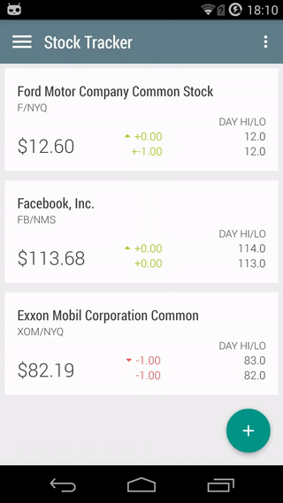
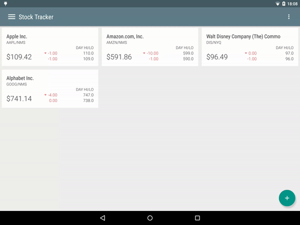

Android Stock Tracker App
=========================

Android app that uses the Yahoo Finance api to display the latest stock prices.

The app uses the YahooFinance-api library (http://financequotes-api.com/) to 
access the api and the MPAndroid Chart Library of Philipp Jahoda https://github.com/PhilJay/MPAndroidChart
 to display historical stock prices.

Pre-requisites
--------------

- Min Android SDK supported v16

Getting Started
---------------

This sample uses the Gradle build system. To build this project, use the
"gradlew build" command or use "Import Project" in Android Studio.

Screenshots
-----------

